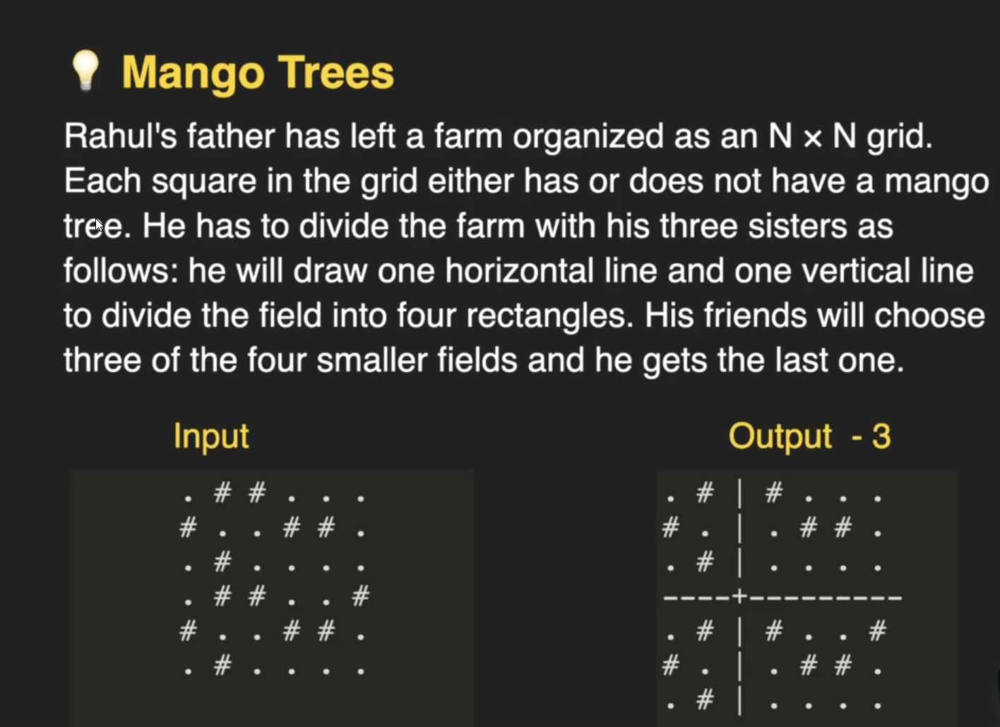
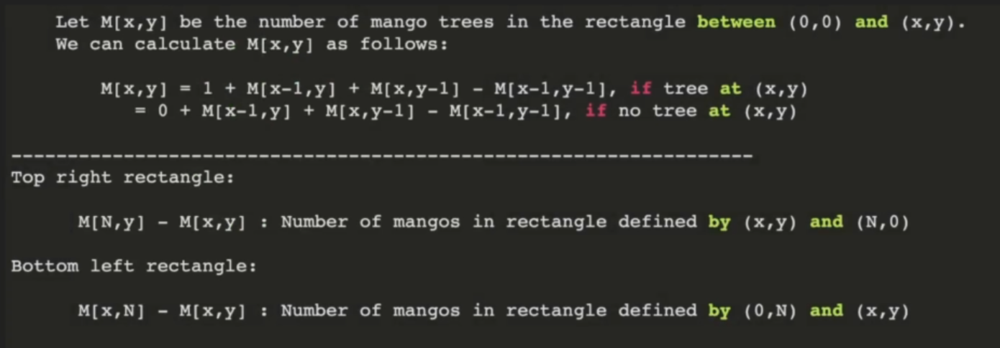

## 2D Arrays

- When passing 2D array as an argument, passing the number of rows is optional but columns is necessary

```cpp

void print(int arr[][100], int n, int m){
    ...
}
```

- How 2D Arrays are stored in memory :

1. Row Major (Most common)
2. Column Major

## 2D Char arrays

```cpp

char numbers[][10] = {
    "one",
    "two",
    "three",
    "forty",
    "eight"
};


```

## Mango Tree

Rahul's father has left a farm organized as an `N x N` grid. Each square in the grid either has or does not have a mango tree. He has to divide the farm with his three sisters as follows:

- He will draw one horizontal and one vertical line to divide the field into four rectangles.
- His friends will choose three of the four smaller fields and he gets the last one i.e. the one with least numbe r of trees.

Goal: Maximum Number of trees he can get

`# = Mango Tree`

**Input:**

```cpp
    char arr[][6] = {{'.', '#', '#', '.', '.', '.'},
                     {'#', '.', '.', '#', '#', '.'},
                     {'.', '#', '.', '.', '.', '.'},
                     {'.', '#', '#', '.', '.', '#'},
                     {'#', '.', '.', '#', '#', '.'},
                     {'.', '#', '.', '.', '.', '.'}};
```

**Output:**

```
                    .  #  |  #  .  .  .
                    #  .  |  .  #  #  .
                    .  #  |  .  .  .  .
                    ------+------------
                    .  #  |  #  .  .  #
                    #  .  |  .  #  #  .
                    .  #  |  .  .  .  .
```



### Brute Force Approach:

- Make a cut at every i,j : Takes `O(N^2)`
- Then compute how many trees are there in each fields : Takes `O(N^2)`
- Then take minimum of every field while computing and track maximum he had achieved yet.
- Total Complexity: `O(N^2 . N^2)`

### 2D Prefix Sums Approach:

- Make an auxilliary Matrix and store all mango trees from `(0,0)` to `(x,y)`



```
4 Field sections can now be computed as:

I       |       II
--------+-----------
III     |       IV


M is the matrix where we precomputed all trees from (0,0) to (x,y)

For Section I:
S1 = M(x,y)

Similarly,
S2 = M(x,m-1) - S1 = M(x,m-1) - M(x,y)

S3 = M(n-1,y) - S1 = M(n-1,y) - M(x,y)

S4  = M(n-1,m-1) - S1 - S2 - S3
    = M(n-1,m-1) - M(x,y) - (M(x,m-1) - M(x,y)) - (M(n-1,y) - M(x,y))
    = M(n-1,m-1) - M(x,y) - M(x,m-1) + M(x,y) - M(n-1,y) + M(x,y)
    = M(n-1,m-1) - M(x,m-1) - M(n-1,y) + M(x,y)
```

- Complexity: `O(N^2)`

**Auxiliary Matrix:**

```cpp
    int M[6][6];
    M[0][0] = arr[0][0] == '#' ? 1 : 0;

    //Topmost Row
    for (int j = 1; j < n; j++)
        M[0][j] = (arr[0][j] == '#' ? 1 : 0) + M[0][j - 1];

    //Leftmost Column
    for (int i = 1; i < n; i++)
        M[i][0] = (arr[i][0] == '#' ? 1 : 0) + M[i - 1][0];

    for (int x = 1; x < n; x++)
        for (int y = 1; y < m; y++)
            if (arr[x][y] == '#')
                M[x][y] = 1 + M[x - 1][y] + M[x][y - 1] - M[x - 1][y - 1];
            else
                M[x][y] = 0 + M[x - 1][y] + M[x][y - 1] - M[x - 1][y - 1];
```

**Finding Max Tree and Cut Position:**

```cpp
    int max_tree = 0, cut_x = 0, cut_y = 0;
    for (int x = 0; x < n; x++)
    {
        int s1, s2, s3, s4, min_section = 0;
        for (int y = 0; y < m; y++)
        {
            s1 = M[x][y];
            s2 = M[x][m - 1] - s1;
            s3 = M[n - 1][y] - s1;
            s4 = M[n - 1][m - 1] - s1 - s2 - s3;

            min_section = min({s1, s2, s3, s4});
            if (min_section > max_tree)
            {
                cut_x = x;
                cut_y = y;
                // max_tree = max(max_tree, min_section);
                max_tree = min_section;
            }
        }
    }
    cout << max_tree << endl;
    cout << "Cut Position: " << cut_x << " " << cut_y;
```
